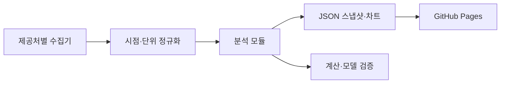

# 플랫폼 구조

팀의 기본 구조는 데이터 수집 → Python 분석 모듈 → 버전이 있는 JSON·차트 → 정적 리서치 화면입니다.



현재는 23개 분석·콘텐츠 탭의 실자료 계산·탐색 화면과 전체25개 탭의 구현 가이드를 제공합니다. 부분 구현 범위는 탭마다 표시합니다. 원형은 단일 HTML에 일반 JavaScript가 탭을 만들고 공개 JSON을 읽는 구조입니다. 팀 버전은 독립 Python 계산과 가벼운 SVG 렌더러를 사용합니다.

```text
pipeline/refresh.py    잠금·별도 계산·검증·게시·Pages 확인
pipeline/cache.py / incremental.py  부모 빈티지와 변경 행·SHA256
pipeline/events_data.py / cot_data.py  RSS·미국 이벤트·CFTC
pipeline/subview_modules.py / subviews.py  세부 화면·미연결 목록
pipeline/universe.py   종목·페어·미확인 항목
pipeline/collect.py    수동·직렬 수집, 날짜별 로컬 압축 CSV
pipeline/store.py      수집 버전·SHA256·가격 필드 선택
pipeline/analytics.py  수익률·RS·누적 초과수익, 오프라인
pipeline/build.py      초기 RS/모멘텀 JSON 구성
pipeline/acquire.py    확장 가격·공식 IVV·재무·FRED 직렬 수집
pipeline/krx_members.py / krx_reconcile.py   승인된 KRX 조회·품질 보정
pipeline/ecos_data.py / local_consensus.py  ECOS·읽기 전용 국내 추정
pipeline/engine.py     캐시 검증·단위·관측일·공통 계산
pipeline/*_modules.py  가격·거시·실적·퀀트·관계 탭
pipeline/ml_models.py / maximus_model.py   시간순 월별 기준모형
pipeline/build_all.py  전체 파생 JSON·25탭 상태 생성
docs/data/*.json       계산 결과·시계열·기준일·범위
docs/charts.js         독립 SVG 선·막대·히트맵
docs/dashboard.js      RS·모멘텀 카드·필터·표·차트
docs/analysis-charts.js / network-views.js  다중축·캔들·3D·지도 SVG
docs/research-dashboard.js  21개 신규 데이터 탭·정렬·검색·로컬 기록
docs/app.js            홈·가이드·경로 선택
```

원자료는 저장소 밖의 형제 `sangsangin-investment-data/`에만 저장합니다. Pages는 JSON을 탭 방문 때 한 번 읽고 필터는 메모리에서 처리합니다. 원본 사이트나 Yahoo에 브라우저 요청을 보내지 않습니다. 사용자가 승인한 평일08/18시 정기 갱신은 이 PC에서 실행하며 검증 후 정적 결과를 게시합니다.

장기 계약은 observation_date, available_at, source, unit, revision_id를 보존하는 것입니다. 현재 가격 모듈은 관측일·수집시각·소스·날짜별 버전·파일 해시를 저장하지만 원천 데이터의 과거 실제 공개시각은 복원하지 못합니다. 이를 available_at으로 오인하지 않습니다. 전체 발행 시각과 하위 모듈 기준일을 구분하며 과거 수집본을 새 수집일의 파일로 덮어쓰지 않습니다.

실시간 모델 실행·질문 API·사용자 인증은 별도 서버가 필요한 기능입니다. GitHub Pages에는 공개 가능한 정적 결과만 배포합니다.

[전체 화면 목록](MODULES.md) · [개발 순서](ROADMAP.md)
