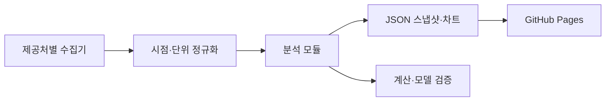

# 플랫폼 구조

팀의 기본 구조는 데이터 수집 → Python 분석 모듈 → 버전이 있는 JSON·차트 → 정적 리서치 화면입니다.

현재는 화면별 구현 가이드가 공개되어 있습니다. 원형은 단일 HTML에 일반 JavaScript가 탭을 만들고 공개 JSON을 읽는 구조입니다. 팀 버전은 공통 데이터 계약과 독립 모듈을 먼저 만들고 동일한 스냅샷을 기준으로 화면을 연결합니다.

각 값에 observation_date, available_at, source, unit, revision_id를 남깁니다. 전체 발행 시각과 하위 모듈 기준일을 구분합니다. 과거 시장의 관측값을 현재의 수정치로 덮어쓰지 않습니다.

실시간 모델 실행·질문 API·사용자 인증은 별도 서버가 필요한 기능입니다. GitHub Pages에는 공개 가능한 정적 결과만 배포합니다.

[전체 화면 목록](MODULES.md) · [개발 순서](ROADMAP.md)
